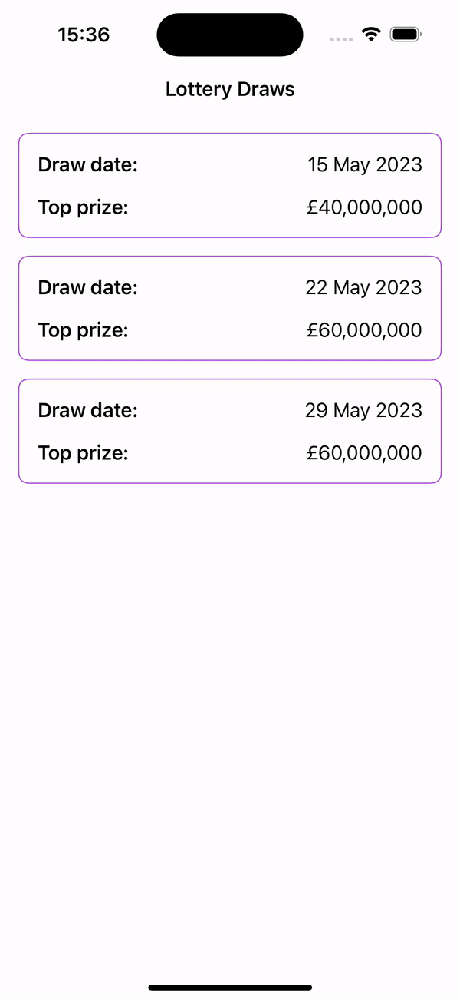
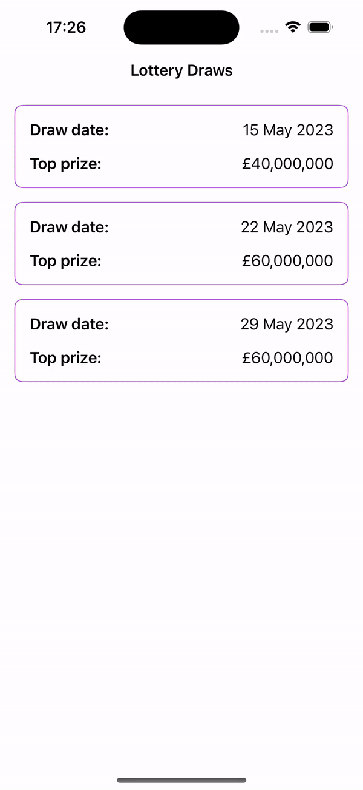

There is no special instructions to run the project, just press a run button in Xcode.
I used Xcode (Version 15.2 (15C500b) and iOS 17.2 Simulator.

## 🌱ABOUT APP

Home Screen - **LotteryDrawsView**
Contains:
- [LotteryDrawCellView]

Fetch draws from the [remote server](https://raw.githubusercontent.com/mariia-cherniuk/Lottery/master/Resources/lotteries.json). If there is no internet connection, retrieve draws from local storage. Tapping on a draw navigates you to the LotteryDrawDetailsView.

Details Screen - **TabDrawDetailsView**
Contains:
- TabView with lottery draws enables you to swipe between details.
- Lottery results, represented as balls.
- Good luck message.
- Generate ticket button.
- [LotteryTicket]

When you tap on "Generate ticket", the most recently generated ticket will be displayed at the top of the "Your tickets" view. 
In this app, a ticket is considered a winner if it contains at least one number that match the lottery result. 
Generated tickets are not saved to the local storage! So, when you navigate back to the screen, previously generated tickets will disappear. 
Given more time, I would focus more on accessibility to ensure the app is available to all users.

## 🌱ARCHITECTURE CHOICE

The project architecture was influenced by the concepts presented in [this video](https://www.youtube.com/watch?v=Nsjsiz2A9mg) 

What I like about this approach is that it establishes clear boundaries between various components of the application, such as the Core, Domain, UI, etc. This separation facilitates scaling the application with minimal impact on its other parts.

DisneyProject:
- Package: Core - application agnostic (Formatters, NetworkManagement, PropertyWrappers, Storage)
- Package: Features (ViewModels and Views)
- Package: Domain - UI-less business logic (Entities, EntitiesPersistence, UseCases)
- Package: DesignLibrary - Reusable views/theming/design tokens

## 🌱 NAVIGATION CHOISE
I chose to implement the latest NavigationStack for handling navigation. Navigation is abstracted through the Coordinator pattern, which uses SwiftUI's NavigationStack behaviour under the hood - an array of destinations for its concrete implementation. 
Since the UI features interact only with the coordinator abstraction, it also simplifies modifying navigation behaviour without affecting the business logic in the view model. 
Navigation is handled by the application, while features use the coordinator to delegate actions (the view model delegates actions through the coordinator).

## 🌱 STORAGE CHOICE
I opted for UserDefaults instead of other storage options because:

- It is tailored for handling smaller data sets. The Lottery object, with its limited number of fields, is perfectly suited for this type of storage.
- Lottery object doesn’t contain any sensitive data.
- Changes are saved immediately to disk.
- It’s easy to read and write with minimal code.
- Implementation details are hidden within an abstraction layer, making it easy to switch to a different storage solution in the future if UserDefaults no longer meets the application's needs.

For more extensive data storage, more sensitive information, or when needing to handle complex data relationships, other storage options like Core Data, SQLite, or the file system are more appropriate.

## 🌱 TESTING

-  I added Unit Tests in essential areas of the application to confirm that individual components perform as expected.
-  For integration tests, I utilised the [Page Object pattern](https://martinfowler.com/bliki/PageObject.html). Each screen (LotteryDrawsView, TabDrawDetailsView) has a corresponding page object class (LotteryDrawsScreen, TabDrawDetailsScreen) that encapsulates the interactions with that screen.
-  I haven't added UI snapshot tests, but I would implement them using the [point-free snapshot library](https://github.com/pointfreeco/swift-snapshot-testing) to ensure all required screen sizes and orientations are thoroughly tested.

## 🌱 How it looks

| Details | Tabbed Details |
| ---- | ---- |
|  |  |
